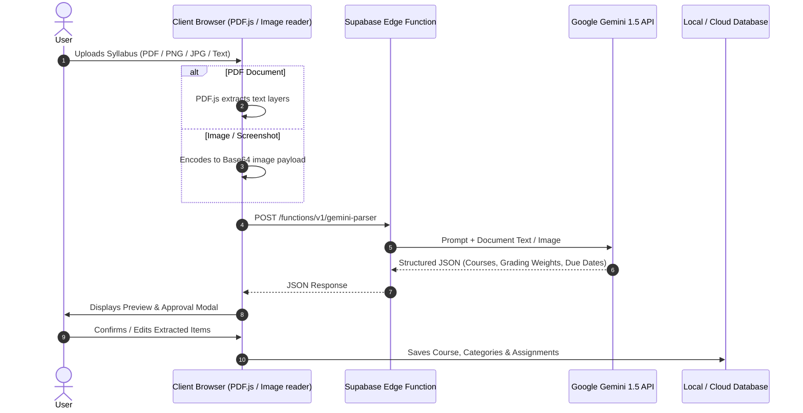

# AI Syllabus & Document Parser 🧠

The **AI Syllabus & Document Parser** enables students to upload raw course syllabi (PDFs, screenshots, or pasted text) and automatically populate their DueVinci dashboard with structured course details, grading rubrics, weekly breakdown schedules, and assignments.

---

## ⚡ How It Works



---

## 📄 Extraction Schema

The Gemini model parses documents and enforces structured JSON responses matching this specification:

```json
{
  "courseName": "Introduction to Computer Science",
  "courseCode": "CS 101",
  "instructor": "Dr. Alan Turing",
  "term": "Fall 2026",
  "gradingScale": {
    "scaleType": "standard_4_0",
    "categories": [
      { "name": "Homework Assignments", "weight": 30 },
      { "name": "Midterm Examination", "weight": 30 },
      { "name": "Final Project", "weight": 40 }
    ]
  },
  "schedule": [
    {
      "weekNumber": 1,
      "topic": "Algorithms & Complexity Basics",
      "reading": "Chapters 1 - 2",
      "deliverables": [
        {
          "title": "Problem Set 1",
          "dueDate": "2026-09-15T23:59:00",
          "category": "Homework Assignments",
          "maxPoints": 100
        }
      ]
    }
  ]
}
```

---

## 🎯 Features

- **Multi-Format Support**:
  - Direct PDF ingestion using `pdf.js` client-side parsing.
  - Image and screenshot uploads (JPG, PNG, WebP) processed multimodally.
  - Plain text and syllabus markdown paste.
- **Interactive Review Modal**: Before importing anything into your workspace, DueVinci presents a diff-like preview where you can uncheck unwanted dates, edit names, or adjust weight percentages.
- **Auto-Weight Normalization**: Automatically validates that grading weight categories total 100% or alerts the user if adjustments are needed.
- **Duplicate Prevention**: Intelligently detects if assignments or courses with similar names already exist in the selected term.
