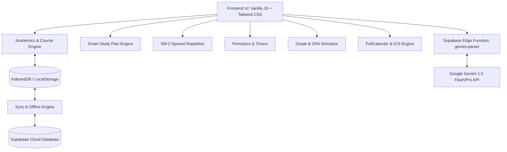

# DueVinci Documentation Wiki 📚

Welcome to the official **DueVinci** Wiki! DueVinci is a modern, student-first academic workspace designed to streamline coursework tracking, grade calculation, study planning, spaced-repetition flashcards, and syllabus parsing into a single, cohesive web dashboard.

---

## 🚀 Quick Navigation

| Section | Description | Key Links |
| :--- | :--- | :--- |
| **🏁 Getting Started** | Installation, environment setup & configuration | • [Getting Started](Getting-Started) • [Architecture & Tech Stack](Architecture-&-Tech-Stack) |
| **💡 Core Features** | In-depth guides for every module | • [AI Syllabus Parser](AI-Syllabus-&-Document-Parser) • [Smart Study Planner](Smart-Study-Planner) • [SM-2 Flashcards](SM-2-Spaced-Repetition-&-Flashcards) • [Course Management](Course-&-Term-Management) • [Grade Tracker & GPA](Grade-Tracker-&-GPA-Calculator) • [Pomodoro & Timers](Pomodoro-Timer-&-Focus-Modes) • [Calendar & .ICS Sync](Calendar-&-Schedule-Sync) |
| **🌐 Offline & Cloud** | Data persistence, PWA & offline synchronization | • [Offline Support & PWA](Offline-Support-&-PWA) • [Data Backup & Cloud Sync](Data-Backup-&-Cloud-Sync) |
| **💻 Developer Center** | Engineering workflows, code conventions & testing | • [Developer Guide & Contributing](Developer-Guide-&-Contributing) • [Testing & CI/CD](Testing-&-CI-CD) • [Wiki Sync Guide](Wiki-Sync-Guide) |
| **❓ Support & Help** | FAQ, tips, and troubleshooting common issues | • [FAQ & Troubleshooting](FAQ-&-Troubleshooting) |

---

## ✨ Key Highlights

- 🧠 **AI-Powered Syllabus Parsing**: Ingest PDF syllabi or screenshots with Google Gemini 1.5 to instantly extract weekly course breakdowns, assignments, and due dates.
- 🎯 **Smart Study Planner**: Dynamically calculates academic workload and recommends optimal daily study blocks to prevent cramming.
- 🃏 **SM-2 Spaced Repetition**: SuperMemo-2 flashcards algorithm with active recall quiz modes and automated flashcard generation.
- 📊 **GPA & Grade Simulator**: Live weighted course average calculations supporting standard 4.0 and weighted 5.0 GPA scales with "What-If" final grade projections.
- ⏱️ **Integrated Pomodoro Timer**: Ambient sounds, custom interval lengths, Web Audio alerts, and productivity stats.
- 📱 **Progressive Web App & Offline Mode**: Full offline capability via IndexedDB with automatic background synchronization upon reconnection.

---

## 🛠️ System Overview

---

## 📖 How to Use this Wiki

- Use the **[Sidebar](_Sidebar)** on the right-hand side (or toggleable on mobile) to navigate across all sections.
- For local development and contributing instructions, head over to [Getting Started](Getting-Started) and [Developer Guide & Contributing](Developer-Guide-&-Contributing).
- Found a bug or want to suggest an improvement? Visit our [GitHub Repository](https://github.com/saappleg/DueVinci).
