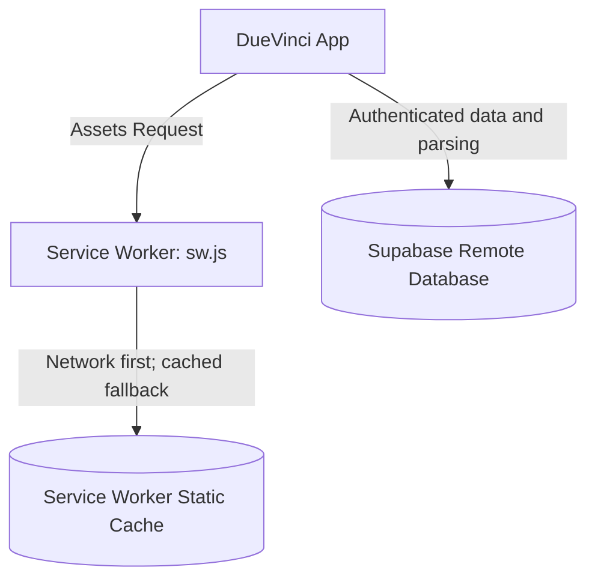

# Offline Support & Progressive Web App (PWA) 📱

DueVinci caches its static application shell for PWA installation and offline fallback. Authentication, Supabase data, and AI parsing are network services and are not guaranteed to work offline.

---

## 🏗️ Offline Architecture

---

## 🛠️ Key Offline Modules

### 1. Service Worker (`sw.js`)
- Caches all essential assets: HTML pages, JavaScript modules, stylesheets, fonts, and icons.
- Uses a network-first strategy with a cached fallback for static application requests.
- Cache versions are bumped for application releases so installed clients receive updated planning logic.

### 2. PWA Controller (`js/modules/pwa.js`)
- Listens for `beforeinstallprompt` to present an unobtrusive, native-feeling install banner.
- Displays an offline badge indicator in the top navbar when network connection drops.
- Listens for `online` and `offline` events to reflect connection state in the UI.

## What works offline

Previously cached pages and application assets can load when the network is unavailable. Creating, reading, or changing cloud data requires a working Supabase connection; export a JSON backup before relying on a long offline session.

---

## 📲 Installing as a PWA

### iOS (iPhone & iPad)
1. Open DueVinci in **Safari**.
2. Tap the **Share** icon (square with arrow up).
3. Scroll down and tap **"Add to Home Screen"**.

### Android
1. Open DueVinci in **Google Chrome**.
2. Tap the **"Install App"** prompt or tap the 3 dots menu $\rightarrow$ **"Install DueVinci"**.

### macOS & Windows Desktop
1. Open DueVinci in **Chrome**, **Edge**, or **Brave**.
2. Click the **Install** button in the omnibox (address bar).
3. Launch DueVinci as a standalone desktop window.
