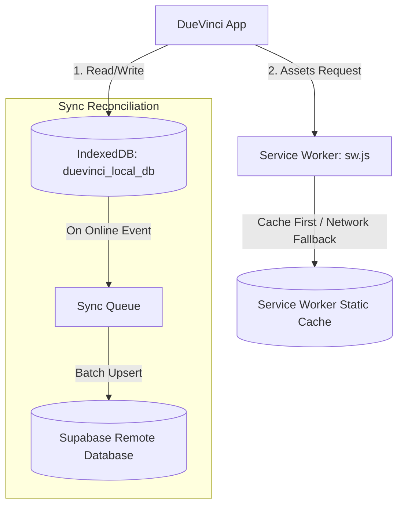

# Offline Support & Progressive Web App (PWA) 📱

DueVinci is built with a **Local-First, Offline-Always** philosophy. Whether you're in a basement lecture hall, on a flight, or studying with spotty Wi-Fi, DueVinci remains fully functional.

---

## 🏗️ Offline Architecture

---

## 🛠️ Key Offline Modules

### 1. IndexedDB Storage (`js/modules/offlineDb.js`)
- Stores complete terms, courses, assignments, study plans, flashcards, and user settings inside structured object stores.
- Transactions are synchronous from the UI perspective, ensuring instantaneous response times (zero spinner lag).

### 2. Service Worker (`sw.js`)
- Caches all essential assets: HTML pages, JavaScript modules, stylesheets, fonts, and icons.
- Implements a **Stale-While-Revalidate / Cache-First** strategy for core application shells.

### 3. PWA Controller (`js/modules/pwa.js`)
- Listens for `beforeinstallprompt` to present an unobtrusive, native-feeling install banner.
- Displays an offline badge indicator in the top navbar when network connection drops.
- Automatically listens for `online` and `offline` window events to trigger background reconciliation.

---

## 📲 Installing as a PWA

### iOS (iPhone & iPad)
1. Open DueVinci in **Safari**.
2. Tap the **Share** icon (square with arrow up).
3. Scroll down and tap **"Add to Home Screen"**.

### Android
1. Open DueVinci in **Google Chrome**.
2. Tap the **"Install App"** prompt or tap the 3 dots menu $\rightarrow$ **"Install DueVinci"**.

### macOS & Windows Desktop
1. Open DueVinci in **Chrome**, **Edge**, or **Brave**.
2. Click the **Install** button in the omnibox (address bar).
3. Launch DueVinci as a standalone desktop window.
