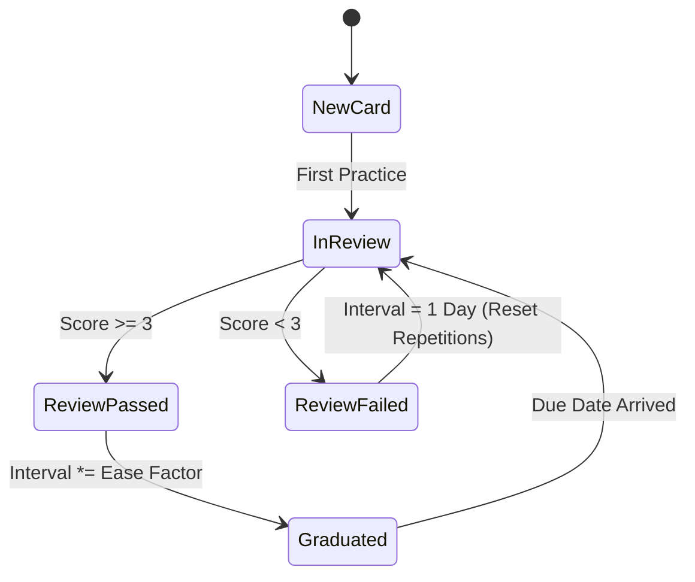

# SM-2 Spaced Repetition & Flashcards 🃏

DueVinci incorporates a native, client-side implementation of the renowned **SuperMemo-2 (SM-2)** spaced repetition algorithm (`js/modules/flashcards.js`) to optimize long-term concept retention for exams and quizzes.

---

## 🧮 The SM-2 Algorithm Explained

The SM-2 algorithm calculates the ideal interval before reviewing a card again based on the user's recall quality rating (from `0` to `5`).

### 1. Recall Quality Ratings ($q$)
- **5 (Perfect Recall)**: Instant, confident response.
- **4 (Good Recall)**: Correct response with brief hesitation.
- **3 (Passable Recall)**: Correct response with noticeable effort.
- **2 (Incorrect / High Effort)**: Incorrect response, but remembered upon seeing answer.
- **1 (Incorrect / Familiar)**: Incorrect response, answer felt familiar.
- **0 (Complete Blackout)**: No memory of the concept.

### 2. Ease Factor Formula
The Ease Factor ($EF$) starts at `2.5` and adapts after each review session:

$$EF' = EF + (0.1 - (5 - q) \times (0.08 + (5 - q) \times 0.02))$$

> [!NOTE]
> The Ease Factor ($EF$) has a strict minimum floor of `1.30` to prevent cards from getting permanently stuck in review loops.

### 3. Interval Calculation ($I$)
- If $q < 3$ (Failed recall): $n = 0, \quad I = 1\text{ day}$
- If $q \ge 3$ (Successful recall):
  - For $n = 1$: $I_1 = 1\text{ day}$
  - For $n = 2$: $I_2 = 6\text{ days}$
  - For $n > 2$: $I_n = I_{n-1} \times EF$

---

## ✨ Features

- 🗂️ **Deck & Tag Management**: Group flashcards by Course, Term, Topic, or Exam.
- ⚡ **Active Recall Quiz Mode**: Fullscreen flip-card interface with keyboard shortcuts:
  - `Space` / `Enter`: Flip card.
  - `1`, `2`, `3`, `4`, `5`: Rate recall quality.
- 🤖 **AI Card Generator**: Generate flashcard decks automatically from syllabus outlines, lecture notes, or markdown files using Google Gemini.
- 📈 **Retention Analytics**: Visual charts showing cards due today, learning cards, and graduated cards.
