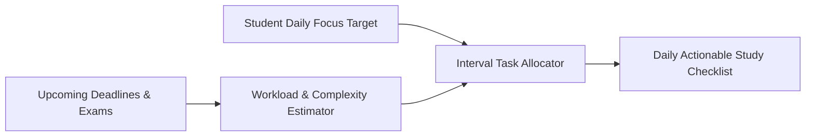

# Smart Study Planner 🎯

The **Smart Study Planner** (`js/modules/studyPlan.js`) solves student burnout and last-minute cramming by algorithmically breaking down major deliverables into balanced, daily focus chunks.

---

## 📊 How the Study Planner Works

Instead of waiting for an assignment due date to arrive, the planner analyzes:
1. **Assignment Deadline ($T_{due}$)**: How many days remain before submission.
2. **Assignment Weight & Difficulty ($W$)**: Percentage of course grade and complexity.
3. **Daily Workload Capacity ($C_{daily}$)**: User-defined maximum focus hours per day.
4. **Existing Commitments**: Other scheduled assignments and exams in the same timeframe.



---

## 🚀 Key Features

### 1. Automatic Milestone Generation
For multi-week projects and major exam prep, the planner automatically generates progressive milestones:
- **Phase 1: Research & Outline** (30% of timeline)
- **Phase 2: Draft / Core Implementation** (40% of timeline)
- **Phase 3: Review & Final Polish** (30% of timeline)

### 2. Workload Balancing
If three exams or assignments fall on the same Friday, the planner distributes study sessions evenly across the preceding two weeks rather than concentrating them on Thursday night.

### 3. Integrated Daily Goals Widget
The homepage dashboard displays today's recommended study plan with:
- Target study duration
- Course breakdown badges
- Checkbox progress tracking
- Direct "Start Pomodoro" trigger for each allocated block

---

## 💻 Code Interface (`studyPlan.js`)

```javascript
import { generateDailyStudySchedule, getPendingStudyTasks } from './modules/studyPlan.js';

// Calculate today's study blocks based on active courses
const todayPlan = generateDailyStudySchedule({
  maxDailyHours: 4,
  includeWeekends: true
});

console.log(todayPlan.tasks);
// [
//   { course: "CS 101", title: "Review Graph Algorithms", durationMinutes: 45 },
//   { course: "MATH 201", title: "Complete Problem Set 3 (Part 1)", durationMinutes: 60 }
// ]
```
