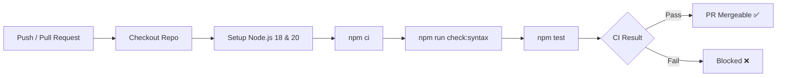

# Testing & CI/CD 🧪

DueVinci maintains a robust automated testing and continuous integration suite to ensure stability across releases.

---

## 🔬 Test Suite (Vitest)

DueVinci uses [Vitest](https://vitest.dev/) for high-speed ESM-native unit testing.

### Running Tests Locally

```bash
# Run all unit tests once
npm test

# Run tests in interactive watch mode (ideal during development)
npm run test:watch

# Generate code coverage reports
npm run test:coverage
```

---

## 📂 Test Coverage Structure

All test files reside in the `tests/` directory:

| Test File | Target Modules / Features Covered |
| :--- | :--- |
| `tests/academic.test.js` | Course CRUD, category weighting, GPA calculations, scale mappings |
| `tests/sm2_spaced_repetition.test.js` | SuperMemo-2 ease factor updates, interval progression, floor clamping |
| `tests/study_plan.test.js` | Workload balancing, deadline allocation, daily task generator |
| `tests/timers.test.js` | Pomodoro interval transitions, duration formatting, state machines |
| `tests/quiz_backup.test.js` | JSON export schema validation, import parsing, migration scripts |
| `tests/markdown.test.js` | HTML sanitization, markdown syntax parsing, KaTeX math rendering |

---

## 🔍 Syntax & Static Checks

To prevent runtime errors in ES6 native modules, the project provides a syntax validation script:

```bash
npm run check:syntax
```
This runs `node --check` against all JavaScript modules in `js/` and `js/modules/` to verify AST correctness.

---

## 🚀 GitHub Actions CI Pipeline

The project includes an automated workflow in `.github/workflows/ci.yml` that triggers on every pull request and push to `main` or `dev`:


